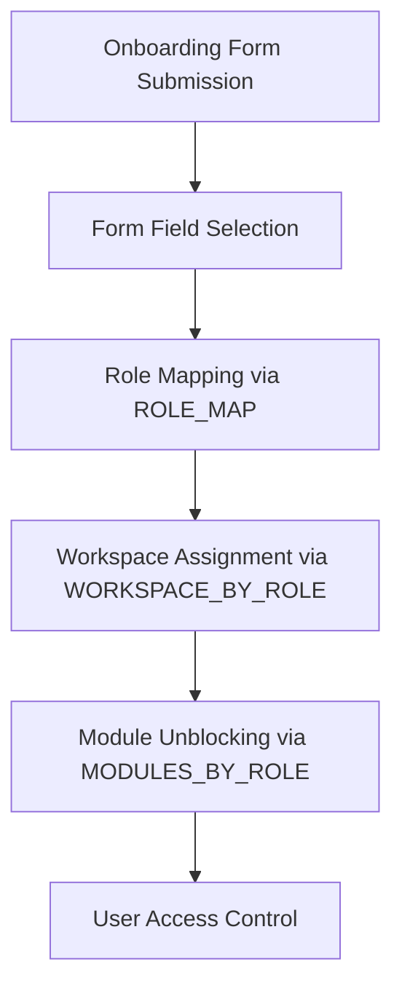

# Climoro Workspace Visibility System

## Overview

The Climoro onboarding app implements a sophisticated workspace visibility system that controls which workspaces and modules users can access based on their company's onboarding form selections and assigned roles. This system ensures that users only see relevant functionality for their organization's needs.

## How It Works

### 1. Form-Based Access Control

When a company completes the onboarding form, their selections in Step 3 (GHG Accounting) determine which workspaces will be visible to all users in that company:

- **Scope 1, 2, 3 Selections**: Enable access to corresponding scope workspaces
- **Sub-scope Options**: Enable access to specific sub-workspaces (e.g., Stationary Emissions, Mobile Combustion)
- **Reduction Options**: Enable access to reduction-related workspaces

### 2. Role-Based Access

The system supports three main user roles with different permission levels:

- **Super Admin**: Company administrator with full access to enabled workspaces
- **Unit Manager**: Unit-level management with limited administrative access
- **Data Analyst**: Read-only access for data analysis and reporting

### 3. Workspace Mapping Flow



## Key Components

### 1. Configuration Mappings

#### Role Map (`ROLE_MAP`)
Maps onboarding form fields to access roles:
```python
{
    "scopes_to_report_scope1": "Scope 1 Access",
    "scopes_to_report_scope2": "Scope 2 Access",
    "scope_1_options_stationary": "Scope 1 Stationary Access",
    # ... more mappings
}
```

#### Workspace Map (`WORKSPACE_BY_ROLE`) 
Maps access roles to workspace labels:
```python
{
    "Scope 1 Access": "Scope 1",
    "Scope 2 Access": "Scope 2", 
    "Scope 1 Stationary Access": "Stationary Emissions",
    # ... more mappings
}
```

#### Module Map (`MODULES_BY_ROLE`)
Maps access roles to modules that should be unblocked:
```python
{
    "Scope 1 Access": ["Scope 1", "Setup"],
    "Scope 2 Access": ["Scope 2", "Setup"],
    # ... more mappings
}
```

### 2. Core Functions

#### `assign_roles_for_company_based_on_onboarding(company_name)`
Main function that processes a company's onboarding selections and applies access controls.

#### `_derive_roles_from_onboarding(onboarding_doc)`
Analyzes the onboarding form and determines which access roles should be granted.

#### `_ensure_workspace_role_restrictions(all_possible_roles)`
Ensures workspaces have correct role restrictions and removes admin access.

#### `_unblock_modules_for_user(user_doc, modules_to_unblock)`
Selectively unblocks modules for users based on their granted roles.

### 3. Visibility Control Mechanisms

1. **Module Blocking**: All modules are blocked by default; only selected ones are unblocked
2. **Workspace Role Gating**: Workspaces require specific roles for access
3. **Global Visibility Reset**: Ensures workspaces aren't globally hidden
4. **Private Page Cleanup**: Removes private workspaces that bypass role restrictions

## Current Role System

### Super Admin
- **Level**: 1 (highest)
- **Description**: Company administrator with full permissions
- **Permissions**: All operations on enabled workspaces
- **User Management**: Can manage other users

### Unit Manager  
- **Level**: 2 
- **Description**: Unit-level management access
- **Permissions**: Read, write, submit operations
- **User Management**: Cannot manage users

### Data Analyst
- **Level**: 3
- **Description**: Data analysis and reporting access  
- **Permissions**: Read-only operations
- **User Management**: Cannot manage users

## Adding New Roles

### Method 1: Using the Enhanced System

```python
from climoro_onboarding.climoro_onboarding.role_management_utils import RoleManagementUtils

# Add a new role
result = RoleManagementUtils.add_custom_role(
    role_name="Quality Manager",
    level=2,
    description="Quality management and oversight", 
    can_manage_users=False,
    permissions=["read", "write", "submit", "report"],
    modules=["Quality Management", "Setup"]
)
```

### Method 2: Using API Calls

```javascript
// From client-side
frappe.call({
    method: "climoro_onboarding.climoro_onboarding.enhanced_workspace_access.add_new_role",
    args: {
        role_name: "Environmental Officer",
        level: 2,
        description: "Environmental compliance and reporting",
        can_manage_users: false,
        default_scopes: []
    }
});
```

### Method 3: Configuration File

Edit `config/workspace_access_config.json`:

```json
{
  "user_role_hierarchy": {
    "Environmental Officer": {
      "level": 2,
      "description": "Environmental compliance and reporting",
      "can_manage_users": false,
      "default_scopes": [],
      "permissions": ["read", "write", "report"]
    }
  }
}
```

## Adding New Scopes/Workspaces

### Adding a New Scope

```python
# Add Scope 4 (Avoided Emissions)
result = RoleManagementUtils.add_workspace_scope(
    scope_name="Scope 4 Access",
    form_field="scopes_to_report_scope4",  # New form field
    workspace_label="Scope 4",
    modules=["Scope 4", "Setup"]
)
```

### Form Field Requirements

1. Add the new field to `onboarding_form.json`
2. Update the form JavaScript to handle the new field
3. Map the field in the configuration

## Extending the Assigned User DocType

To add new roles to the Assigned User selection:

```python
# Update role options
RoleManagementUtils.update_assigned_user_roles([
    "Quality Manager",
    "Environmental Officer", 
    "Compliance Officer"
])
```

## System Integration Points

### 1. Document Hooks
- **User creation**: Auto-assigns roles based on company onboarding
- **Onboarding updates**: Re-syncs workspace access when forms are modified

### 2. Frontend Integration  
- **workspace_filter.js**: Client-side filtering of sidebar items
- **Form JavaScript**: Dynamic field visibility based on selections

### 3. Permission System
- **DocPerm entries**: Ensures read access to required doctypes
- **Module blocking**: Controls sidebar module visibility

## Configuration Management

### Location
- Primary config: `config/workspace_access_config.json`
- Fallback: Hard-coded defaults in `enhanced_workspace_access.py`

### Structure
```json
{
  "role_mappings": { "form_field": "role_name" },
  "workspace_mappings": { "role_name": "workspace_label" },
  "module_mappings": { "role_name": ["module1", "module2"] },
  "user_role_hierarchy": { "role_name": { "level": 1, ... } },
  "extensible_roles": { "available_permissions": [...] }
}
```

## Best Practices

### 1. Role Naming
- Use descriptive names ending in role type (e.g., "Environmental Officer")
- Access roles should end with "Access" (e.g., "Scope 4 Access")

### 2. Permission Levels
- **Level 1**: Full administrative access
- **Level 2**: Management/supervisory access  
- **Level 3**: Operational access
- **Level 4**: Read-only access

### 3. Module Organization
- Always include "Setup" module for basic functionality
- Group related modules logically
- Use consistent naming conventions

### 4. Testing New Roles
1. Add the role using utility functions
2. Test with a dummy company and user
3. Verify workspace visibility
4. Check module access
5. Validate permissions

## Troubleshooting

### Common Issues

1. **Workspace not visible**: Check role mapping and workspace configuration
2. **Module still blocked**: Verify module mapping and ensure unblocking logic runs
3. **Permission denied**: Check role permissions and DocPerm entries
4. **Role not found**: Ensure role exists in both config and Frappe Role doctype

### Validation Tools

```python
# Validate current configuration
from climoro_onboarding.climoro_onboarding.role_management_utils import RoleManagementUtils
validation_result = RoleManagementUtils.validate_role_configuration()
print(validation_result)
```

## Migration Notes

### From Legacy System
The enhanced system maintains backward compatibility with the original `ghg_workspace_access.py`. Existing installations will continue to work while gaining extensibility features.

### Configuration Migration
```python
# Migrate existing hardcoded config to JSON
workspace_access_manager._save_config()
```

## Security Considerations

1. **Role Hierarchy**: Lower-level roles cannot access higher-level functions
2. **Company Isolation**: Users can only access their company's selected scopes
3. **Module Blocking**: Prevents access to unselected functionality
4. **Private Workspace Cleanup**: Removes potential bypass mechanisms

## Performance Optimization

1. **Lazy Loading**: Configuration loaded only when needed
2. **Caching**: Role assignments cached per company
3. **Batch Updates**: Multiple workspace updates in single transaction
4. **Minimal Queries**: Optimized database access patterns

## Future Enhancements

1. **Dynamic Form Fields**: Auto-generate form fields from configuration
2. **Role Templates**: Pre-defined role sets for common industries
3. **Conditional Access**: Time-based or condition-based workspace access
4. **Audit Trail**: Track all role and permission changes
5. **Multi-tenant**: Support for multiple organizations per company
